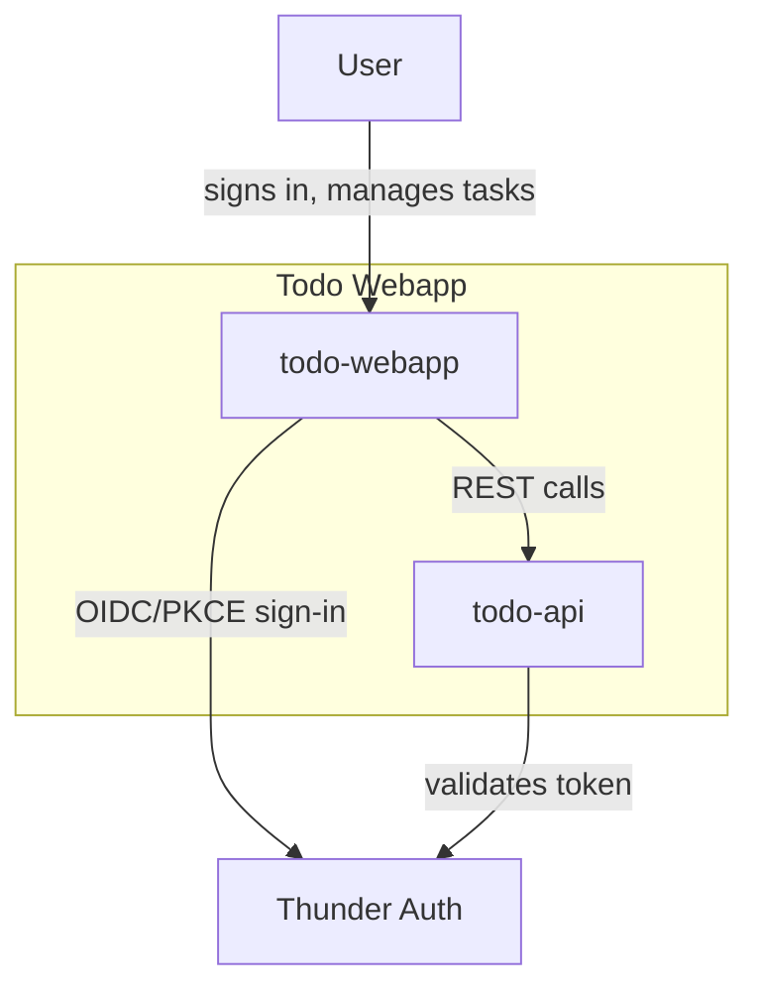
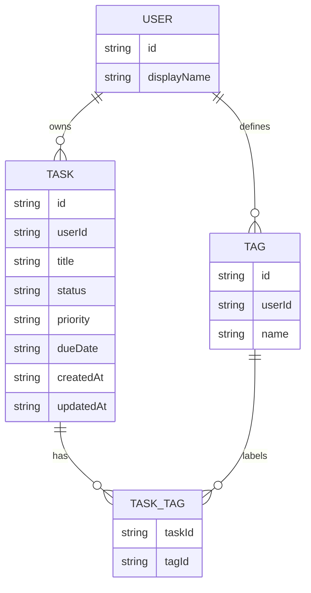
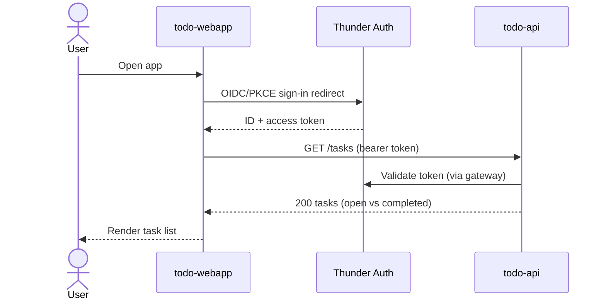
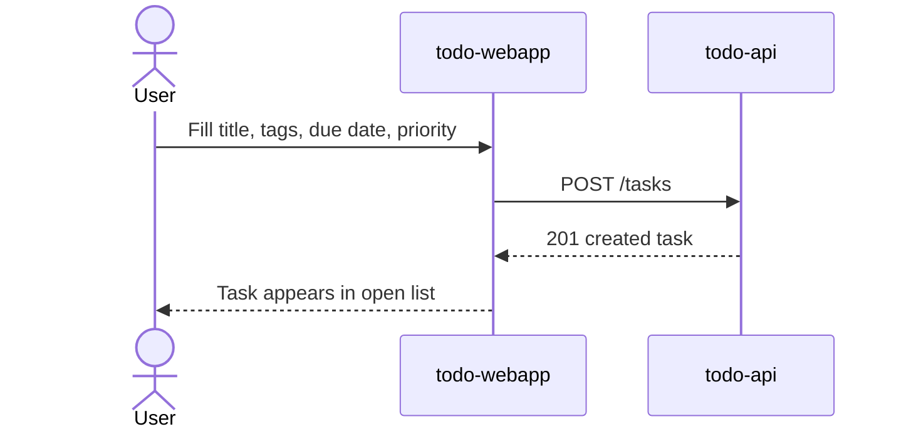
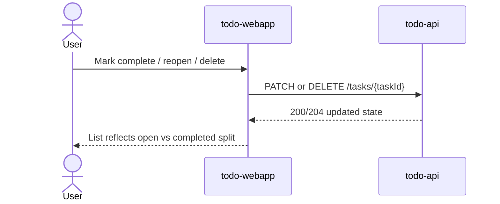
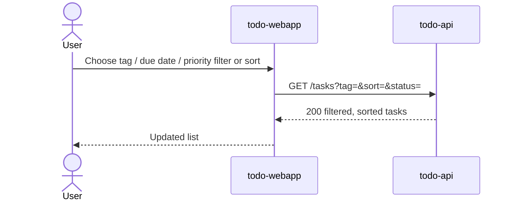

# Todo Webapp — Design

## Overview

A single-page React application (`todo-webapp`) lets a signed-in user manage a personal, flat list of tasks — each with optional tags, an optional due date, and a priority — backed by a Ballerina service (`todo-api`) that owns the task data in a project-scoped Postgres database. Sign-in for the SPA and identity for the API both flow through Thunder, the platform IDP; the API gateway fronts `todo-api` and injects the caller's identity on every call.

## Context (C1)

## Domain model (ER)

## Key flows

### Sign in and load tasks

### Create, tag, and prioritize a task

### Complete, reopen, or delete a task

### Filter and sort tasks

